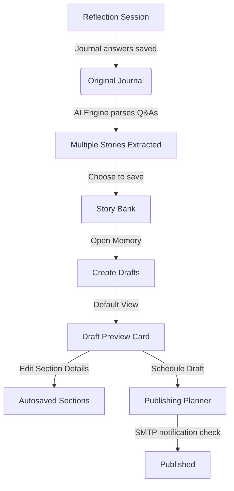

# CreatorOS 🚀
> *Your Personal Creator Operating System — bridging the gap between authentic memories and publishable content.*

CreatorOS is a paired pair-programming tool designed to capture raw personal experiences (your "journal memories"), intelligently extract story angles, draft high-converting social media posts across formats, and manage scheduling and publishing.

---

## 🌟 Core Modules & Workflow



### 1. Guided Reflection
* **Journal Companion**: Behave like a secure, warm personal journal.
* **Complete Storage**: Preserves AI questions, answers, mood analysis, and timestamps permanently.
* **Multiple Story Extraction**: A single reflection session can yield multiple independent stories. Creators choose what to save or discard before committing.

### 2. Story Bank
* **Memory Preservation**: Stories act as permanent memory units. You can revisit the exact journal entry, questions, and answers that birthed the story.
* **Draft Relationships**: A single Story card supports multiple formats (LinkedIn Post, Instagram Reel, Carousel, Twitter Thread) without duplicating the memory.

### 3. Content Studio
* **Preview First**: Opens drafts in a clean, non-editable Preview view resembling a published card layout, complete with **Hook**, **Experience**, **Conflict**, **Lesson**, **CTA**, **Caption**, and **Hashtags**.
* **Draft CRUD & Actions**: Support editing, duplicating, scheduling, and deletion with persistent database sync.

### 4. Publishing Planner
* **Dynamic Calendar**: Never utilizes dummy cards. Connects directly to the scheduled queue database.
* **Double Scheduling Workflow**:
  1. Open a draft preview and schedule it inline.
  2. Open the planner directly, select an unscheduled draft from the queue, and set the posting date and time.
* **Detailed cards**: Displays draft details, parent story title, type, and a 2-3 line text preview snippet.

---

## 🛠️ Technical Stack

* **Frontend**: Next.js (App Router), TailwindCSS, Framer Motion, TanStack Query, Lucide Icons.
* **Backend**: FastAPI, SQLAlchemy (ORM), SQLite (database), Gemini API (structured story extraction), SentenceTransformers (vector semantic similarity).

---

## 🚀 Setup and Run

### Prerequisites
* Python 3.10+
* Node.js 18+

### 1. Backend Service
1. Navigate to the `backend/` directory.
2. Initialize and configure the environment variables:
   ```bash
   cp .env.example .env
   # Open .env and insert your GEMINI_API_KEY
   ```
3. Install dependencies:
   ```bash
   pip install -r requirements.txt
   ```
4. Run the API server:
   ```bash
   python -m uvicorn app.main:app --reload
   ```
   The backend will start on `http://127.0.0.1:8000`.

### 2. Frontend Service
1. Navigate to the `Frontend/` directory.
2. Install npm dependencies:
   ```bash
   npm install
   ```
3. Run the development server:
   ```bash
   npm run dev
   ```
   Open `http://localhost:3000` in your web browser.

---

## 🔒 License
CreatorOS is created for authenticated private usage by content creators. All stored reflections are private and kept on the SQLite database instances.
